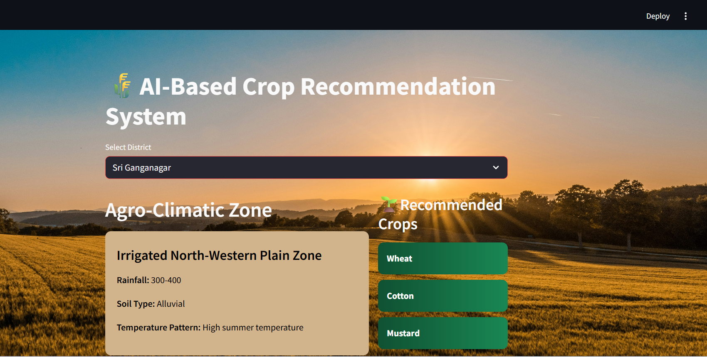

# 🌾 AI-Based High-Value Crop Recommendation System

---

## 📌 Project Overview

This project provides district-wise crop recommendations for Rajasthan using agro-climatic data.

---

## 📸 Application Preview

---

## 🚀 Features

- District selection dropdown  
- Agro-climatic zone display  
- Recommended crops  

---

## 🛠️ Tech Stack

- Python  
- Streamlit  
- Pandas  

#

    📂 Project Structure
        ├── app.py
        ├── agro-climatic-data-district-wise.json
        ├── requirements.txt
        └── README.md

### ▶️ How to Run Locally

Clone the repository:

    git clone https://github.com/Raushani84-ag/crop-recommendation-app.git

Navigate into project folder:

    cd rajasthan-crop-recommendation

Install dependencies:

    pip install -r requirements.txt

Run Streamlit app:

    streamlit run app.py

